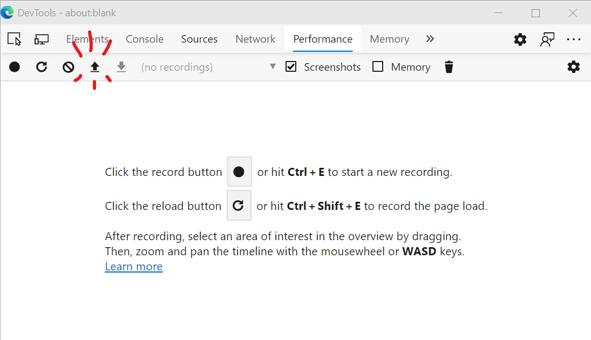

# Profiling `lage`

A particularly complex monorepo can present opporunities for optimization. For example, when there are really large packages, it might be more efficient to break those up so the build can be split across different CPU cores. `lage` greatly enhances the ability for developers to see where the bottlenecks are.

To collect a profile of the `lage` run, simply run `lage` with the same arguments while adding the `--profile` argument.

```
lage build test --profile
```

## Using the profile

When the run is finished, a profile JSON file is produced. This file is to be imported into a Chromium-based browser's devtools Performance tab.



## Sample of `lage` profile session

For example, you can see the following `lage` run of the [Fluent UI](https://developer.microsoft.com/en-us/fluentui/#/components) repo. You can see that there is a dip in the concurrency when building the `office-ui-fabric-react` package. This makes sense, because many internal packages depends on that one large package.


