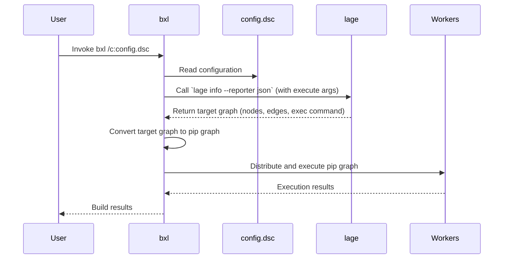
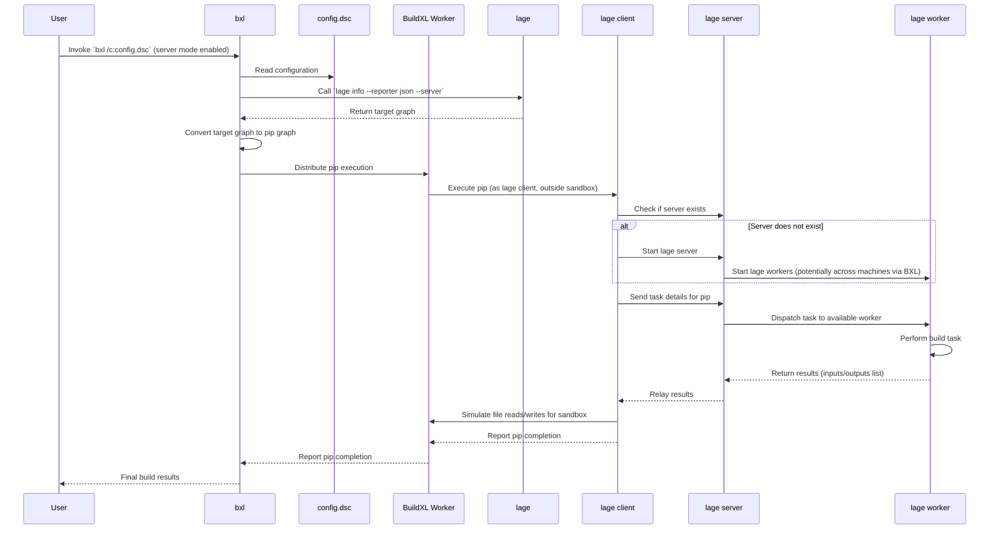

`lage` itself is a single-node build orchestrator. To scale behind one machine, we need to employ another tool. Microsoft has an internal tool, available publically as an Open Source project, called `BuildXL`. BuildXL is used to build some of the biggest projects within Microsoft like Windows and Office.

## Overview of lage and BuildXL integration

In this mode, `lage` becomes a specific "frontend" to the BuildXL executable. It essentially provides two things for BuildXL:

- a build graph
- a set of instructions on how to execute the nodes on the graph

BuildXL takes over the orchestration and can perform all the necessary work to enable distributed builds. To support that, BuildXL takes over some aspects that were previously done by `lage`'s scheduler:

- hashing via sandboxed processes
- distributed cache
- orchestration across multiple workers across different machines
- centralized logging and transferring post-build artifacts into the orchestrator machine

## Differences in Strictness

Lage relies heavily on convention and some configuration to produce its build graph and its hashes. However, in this kind of approach, the build scripts might take on dependencies that are not accounted for. This sort of looseness does not work well in a build system that needs to transfer its context between machines during a distributed build environment. BuildXL has a higher quality method of ensuring its build context and caches are very dependendable via its "sandboxed process". In BuildXL, by default all files that were accessed (read or written) are considered as part of the input and output of a build. The configuration allows for exclusions to preserve a measure of portability.

A `lage` target is called "pip" in BuildXL - historically, BuildXL was named "Domino", and a pip is a dot on the tiles. The unit of work in `lage` is a target which is a "task" in a "package", that translates roughly to BuildXL's pip. BuildXL does not know anything about JS monorepo workspaces, nor does it know about the `package.json` format - these are things that `lage` will need to supply as a "pip graph".

## Two Methods of Integration

### Built-in Lage Frontend

The typical way to integrate `lage` and `buildxl` is to create a `config.dsc` file in the monorepo. The `bxl` command will take this configuration file and execute the pip graph just like `lage`.

```
config({
  resolvers: [
      {
        kind: "Lage",
        ...
        npmLocation: f`path/to/npm.cmd`,
        execute: ["build", "test"],
      }
  ]
});
```

Then run BuildXL this way: `bxl /c:config.dsc`. Roughly what happens inside BuildXL is this:



Note: we're skipping all kinds of details about how BuildXL internally hashes, caches, and skips the pips in its execution.

### Server-worker

For certain `lage` targets where it is infeasible to solely utilize hash & cache to speed up the performance, we may need to re-use certain objects in memory from target run to run. This calls for a feature with lage named "Server Worker". The difference is that `lage`


